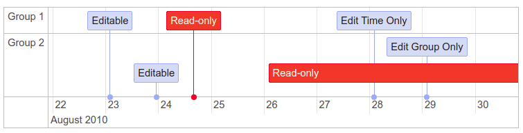

# vis-timeline



The Timeline/Graph2D is an interactive visualization chart to visualize data in time. The data items can take place on a single date, or have a start and end date (a range). You can freely move and zoom in the timeline by dragging and scrolling in the Timeline. Items can be created, edited, and deleted in the timeline. The time scale on the axis is adjusted automatically, and supports scales ranging from milliseconds to years.

## Badges

[](https://github.com/visjs/vis-timeline/graphs/contributors)
[](https://github.com/almende/vis/stargazers)

[](#backers) [](#sponsors) 

## Install

Install via npm:

    $ npm install vis-timeline

## Example

A basic example on loading a Timeline is shown below. More examples can be
found in the [examples directory](https://github.com/visjs/vis-timeline/tree/master/examples/)
of the project.

```html
<!doctype html>
<html>
<head>
  <title>Network</title>
  <script type="text/javascript" src="//unpkg.com/vis-timeline@latest/dist/vis-timeline-graph2d.min.js"></script>
  <link href="//unpkg.com/vis-timeline@latest/dist/vis-timeline-graph2d.min.css" rel="stylesheet" type="text/css" />
  <style type="text/css">
    #mynetwork {
      width: 600px;
      height: 400px;
      border: 1px solid lightgray;
    }
  </style>
</head>
<body>
<div id="visualization"></div>
<script type="text/javascript">
  // DOM element where the Timeline will be attached
  var container = document.getElementById('visualization');

  // Create a DataSet (allows two way data-binding)
  var items = new vis.DataSet([
    {id: 1, content: 'item 1', start: '2014-04-20'},
    {id: 2, content: 'item 2', start: '2014-04-14'},
    {id: 3, content: 'item 3', start: '2014-04-18'},
    {id: 4, content: 'item 4', start: '2014-04-16', end: '2014-04-19'},
    {id: 5, content: 'item 5', start: '2014-04-25'},
    {id: 6, content: 'item 6', start: '2014-04-27', type: 'point'}
  ]);

  // Configuration for the Timeline
  var options = {};

  // Create a Timeline
  var timeline = new vis.Timeline(container, items, options);
</script>
</body>
</html>
```

## Build

To build the library from source, clone the project from github

    $ git clone git://github.com/visjs/vis-timeline.git

The source code uses the module style of node (require and module.exports) to
organize dependencies. To install all dependencies and build the library,
run `npm install` in the root of the project.

    $ cd vis-timeline
    $ npm install

Then, the project can be build running:

    $ npm run build

### Excluding external dependencies

External dependencies such as moment, hammerjs can be excluded in the build by running:

    $ npm run build -- -e [comma separated module names]

Example:

    $ npm run build -- -e moment,hammerjs

## Test

To test the library, install the project dependencies once:

    $ npm install

Then run the tests:

    $ npm run test

## Contribute

Contributions to the vis.js library are very welcome! We can't do this alone!

### Backers

Thank you to all our backers! 🙏

<a href="https://opencollective.com/visjs#backers" target="_blank"></a>

### Sponsors

Support this project by becoming a sponsor. Your logo will show up here with a link to your website.

<a href="https://opencollective.com/visjs/sponsor/0/website" target="_blank"></a>
<a href="https://opencollective.com/visjs/sponsor/1/website" target="_blank"></a>
<a href="https://opencollective.com/visjs/sponsor/2/website" target="_blank"></a>
<a href="https://opencollective.com/visjs/sponsor/3/website" target="_blank"></a>
<a href="https://opencollective.com/visjs/sponsor/4/website" target="_blank"></a>
<a href="https://opencollective.com/visjs/sponsor/5/website" target="_blank"></a>
<a href="https://opencollective.com/visjs/sponsor/6/website" target="_blank"></a>
<a href="https://opencollective.com/visjs/sponsor/7/website" target="_blank"></a>
<a href="https://opencollective.com/visjs/sponsor/8/website" target="_blank"></a>
<a href="https://opencollective.com/visjs/sponsor/9/website" target="_blank"></a>

## License

Copyright (C) 2010-2018 Almende B.V. and Contributors

Vis.js is dual licensed under both

  * The Apache 2.0 License
    http://www.apache.org/licenses/LICENSE-2.0

and

  * The MIT License
    http://opensource.org/licenses/MIT

Vis.js may be distributed under either license.